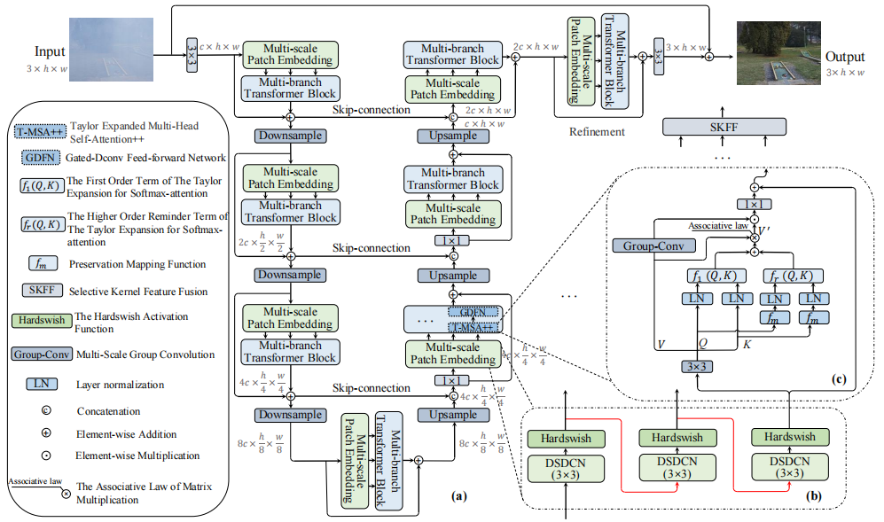

# MB-TaylorFormer V2: Improved Multi-branch Linear Transformer Expanded by Taylor Formula for Image Restoration

This repository contains the official implementation of the following paper:
> MB-TaylorFormer V2: Improved Multi-branch Linear Transformer Expanded by Taylor Formula for Image Restoration<br>
> [Yuwei Qiu](https://arxiv.org/search/cs?searchtype=author&query=Qiu%2C+Y), [Kaihao Zhang](https://arxiv.org/search/cs?searchtype=author&query=Zhang%2C+K), [Chenxi Wang](https://arxiv.org/search/cs?searchtype=author&query=Wang%2C+C), [Wenhan Luo](https://arxiv.org/search/cs?searchtype=author&query=Luo%2C+W), [Hongdong Li](https://arxiv.org/search/cs?searchtype=author&query=Li%2C+H), [Zhi Jin](https://arxiv.org/search/cs?searchtype=author&query=Jin%2C+Z)<sup>*</sup><br>   
**Paper Link:** [[official link](https://arxiv.org/abs/2501.04486)] 

## Overview

Architecture of MB-TaylorFormer V2. (a) MB-TaylorFormer V2 consists of the multi-branch hierarchical design based on multi-scale patch embedding. (b) Multi-scale patch embedding embeds coarse-to-fine patches. (c) T-MSA++ with linear computational complexity

## Installation

See [INSTALL.md](https://github.com/FVL2020/MB-TaylorFormerV2/blob/main/INSTALL.md) for the installation of dependencies required to run MB-TaylorFormerV2.


## Prepare pretrained models

 **Download Links:** [[Baidu Netdisk](https://pan.baidu.com/s/11V-wD01rPTHMFFJyjB0R0w)] password: pami

## Training and Evaluation

<table>
  <tr>
    <th align="left">Task</th>
    <th align="center">Training Instructions</th>
    <th align="center">Testing Instructions</th>
  </tr>
    <tr>
    <td align="left">Dehazing</td>
    <td align="center"><a href="Dehazing/README.md">Link</a></td>
    <td align="center"><a href="Dehazing/README.md">Link</a></td>
  </tr>
  <tr>
    <td align="left">Deraining</td>
    <td align="center"><a href="Deraining/README.md">Link</a></td>
    <td align="center"><a href="Deraining/README.md">Link</a></td>
  </tr>
  <tr>
    <td>Desnowing</td>
    <td align="center"><a href="Desnowing/README.md">Link</a></td>
    <td align="center"><a href="Desnowing/README.md">Link</a></td>
  </tr>
  <tr>
    <td>Denoising</td>
    <td align="center"><a href="Denoising/README.md">Link</a></td>
    <td align="center"><a href="Denoising/README.md">Link</a></td>
  </tr>
  <tr>
    <td>Deblurring</td>
    <td align="center"><a href="Deblurring/README.md">Link</a></td>
    <td align="center"><a href="Deblurring/README.md">Link</a></td>
  </tr>
</table>


## Citation

   If you find our repo useful for your research, please consider citing our paper:

   ```bibtex
   @article{jin2025mb,
   title={MB-TaylorFormer V2: Improved Multi-branch Linear Transformer Expanded by Taylor Formula for Image Restoration},
   author={Jin, Zhi and Qiu, Yuwei and Zhang, Kaihao and Li, Hongdong and Luo, Wenhan},
   journal={TPAMI},
   year={2025}
   }
   ```

## Acknowledgments

This code is based on [Restormer](https://github.com/swz30/Restormer) and [MPViT](https://github.com/youngwanLEE/MPViT).


